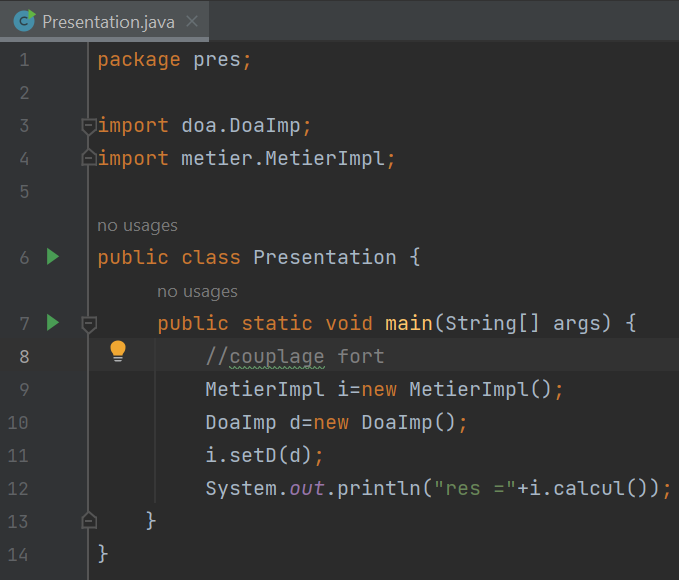

<h3>L'injection des dépendances (part1) </h3>
<h4>1)  L'interface IDao avec une méthode getData</h4>

<h4>2) L'implémentation de l'interface IDao</h4>

<h4>3) L'interface IMetier</h4>

<h4>3) L'implémentation de l'interface IMetier en utilisant le couplage faible</h4>

<h4>4) L'injection des dépendances (Par instanciation statique)</h4>

<h4>4) L'injection des dépendances ( Par instanciation dynamiques)</h4>

